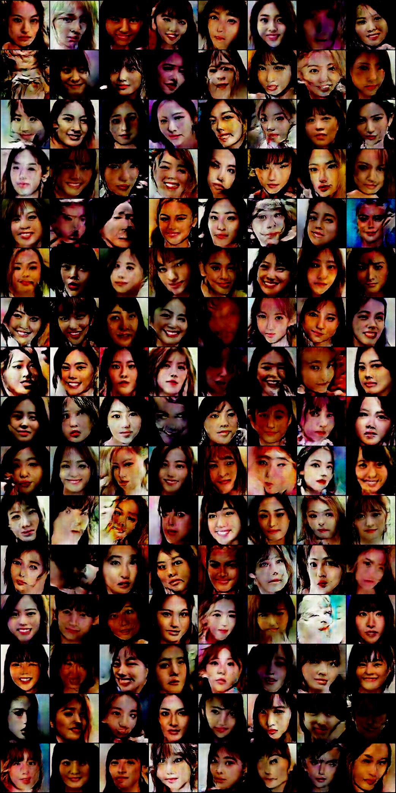
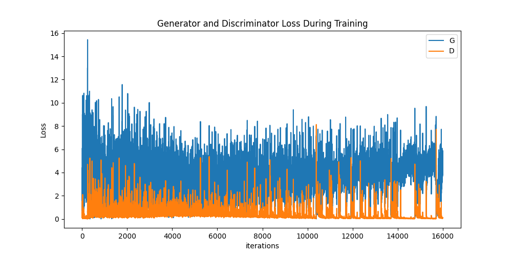

# FaceGenesisDCGAN

This project aims to learn the architecture and performance of the model by generating images with the [DCGAN](https://arxiv.org/pdf/1511.06434.pdf) model. 

## Results
#### Output results for each 10epoch
<video src="assets/timelaps.mp4" width="320" height="240" controls>
  お使いのブラウザはビデオタグをサポートしていません。
</video> 
Training results of about 4000 images resized to 128*128 and rotated 500 epochs with batch size 64.
The results are roughly the same as in the paper.
  

#### Result of the 400th epoch

Result of the 400th epoch. After this, there is a trend of mode decay.
  

#### Generator and Discriminator Loss During Training

Discreminater's Loss is too low. Confirmation that this is the problem described in the paper.
  

#### consideration
This time we went from dataset collection to training. I am sure there were many more combinations, such as convolutional layers, but due to time constraints, I will keep it at this point. I realized once again that the difficulty of generative AI is that the trigger for improving accuracy is not clear until the very end. Next time, I would like to try something with higher quotients, such as high image quality.
## Usage

### Prerequisites
This application shall conform to the following **. /docker** environment. The following is the procedure for building the docker environment for this application.
1. build docker image
    >sh . /docker/build.sh
2. start docker container
    >sh . /docker/into.sh

### Data Preparation

### Training
Execute the following command to start learning. The conditions for learning can be changed in the sh file. 
> sh run_train.sh
## References
- [DCGAN Papers](https://arxiv.org/pdf/1511.06434.pdf) 
